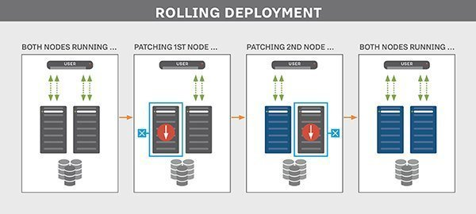

# TP2 Par luis carlos quezada valle

## Approches de déploiement 

1. Déploiement progressif
    Utilise plusieur serveur ou instance en cloud qui hébergeant une copie de l’application.
    

    Cela permet de pouvoir répartie la charge acheminé (le trafic) entre les serveurs.

    Il permet aussi d'échelonné des modifications de sorte que la mise à jour s’active sur certains serveurs ou instances avant d’autres. Ainsi Au fur et à mesure que le trafic arrive dans l’application, certains utilisateurs interagissent avec le nouveau code, tandis que d’autres se retrouvent sur la version existante en production. En cas que l'actualisation porte un prombleme le trafic est redirigé vers les cerveur qui n'ont pas encore été actualisé.

    1. Pour
        Très bon pour les petites modifications.
        Bon pour les compagnies qui on un grande infrastructure d’hébergement pour que même si certain cerveur sont hors usage il y ai aucune dégradation des performances

    2. Contre
        Si le changement est majeur,  il se peut qu on ce trouve avec des utilisateurs untilisant deux versions differentes. Cela peut cosait dee problemes d'équipes et le relation avec les contractants. De plus, il faut que l'équipe technique soit capable d'identifier la version de l'utilisateur et savoir comment repondre au besoin du client dans les deux versions.

    Conclusion   
        
        Conclusion l'approche de déploiment progressif est bien utile pour les application web  avec un interface utilisateur qui evoluent de peut en peut.

2. Déploiement blue/green

    Utilise deux infrastructures d’hébergement d’applications distinctes.

    

    Une pour héberger l'aplication de production, donc pour les utilisateurs,
    l'autre est tenues en reserve comme un environement de test pour les nouvelles version de l'aplication.

    1. Pour
        Permet de bien tester la nouvelle version d'une aplication sans affecter les client/utilisateur
        Fait une seulle actualisation pour tous les clients/utilisateur.
        

    2. Contre
        Cette approche a besoin d'avoir deux fois le même structure d'hebergement donc les couts sont deux fois plus grandes.
        Le support pour une des versiont  n'est pas toujour a point vu que l'équipe technique travaille soit dans une nouvelle version ou dans le version courante a moin d'avoir une très grande équipe, qui augmente encore un fois le cout de cette approche.
  

    Conclusion   
    
        En conclusion, cette approche est surtout plus profitable pour des grosses compagnies.

3. Déploiement canary

    C'est un melange entre la méthode bleugreen and progressif.

    

    Deux mode une avec la version nouvelle et l'autre courante.
    La difference est que la nouvelle version est à la disposition de certains utilisateurs qui vont le tester avant d'être accècible à tous.

    1. Pour
        Après que la nouvelle version soit utilisé par un groupe d'utilisateur celect, On peut plus facillement corriger les bugs reporter pas ces derniers.Donc, après un certain temps on peut rendre accecible la nouvelle versions corrigé a tous.
        Pas besoin de deux infrastructure complete.

       
    2. Contre
        Les utilisateurs de la nouvelle version doit accepter les risques de la nouvelle version.

        
    Conclusion    

        Donc, c'est une technique utile pour les startups ou d’autres entreprises soumises à des contraintes budgétaires.  

4. Fournissuer

    1. Firebase
        Le premier fournisseur est Firebase d’amazon. Il permet  d'utilisé la méthode  canary. Il est gratuits pour une utilisation 1GB de real-time database.
        [Firebase price](https://firebase.google.com/pricing)

        Il donne des analyses de comportement des usagés.
        Il permet une grande facilite dans le système d’authentification et permet joindre son compte d’un autre réseau sociale connexe nord-américain.
        Il permet d’utiliser le cloud messaging, donc envoyer ou recevoir des message entre les plateforme IOS ,Android et web sans fraie. 
        Comporte un hébergement Cloud NO-SQL qui synchroniser avec les utilisateurs en temp réel qui fonction même quand l’application est éteinte. 

    2. Capistrano
        Le deuxieme fournissuer est Capstrano. Il utilise la méthode de déploiement progressif et il est un outil open source.
        
        [Capistrano ](https://capistranorb.com/)

    3.

5. Recomendation

    Vue que notre application n’est pas trop grande, qu’elle n’aura pas besoin de grande actualisation et il y aura des petits changement plusieurs fois. Je recommande d’utiliser l’approche de déploiement progressif. Donc dans notre cas on devrait utiliser Capistrano.

    
        
